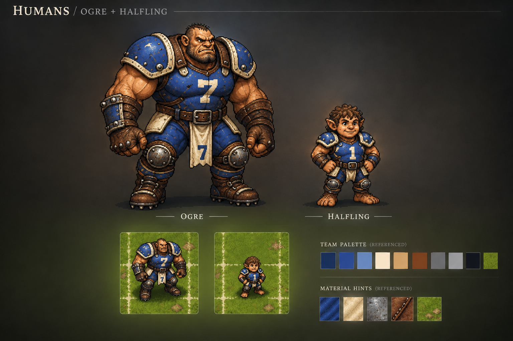
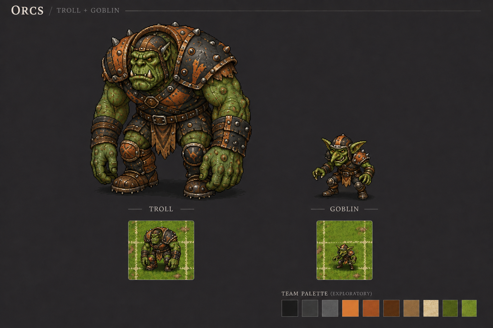

# Humans, Orcs and match-screen concepts

Preliminary visual exploration, 2026-09-06. Produced with the built-in image-generation tool for owner review; [exact prompts and reference chain](prompts.md). All three images are 1536 × 1024 PNG concept boards. These are neither executable UI nor production-ready sprite atlases. Existing game assets remain unchanged.

**Update, 2026-09-07:** the owner approves the Human/Orc direction. New matching
position sheets add Ogre/Halfling and Troll/Goblin below. The
[revised pitch and UI requirements](pitch-and-ui-requirements-v2.md) supersede the
original pitch image's grid and panel proportions. Open the
[interactive layout study](pitch-review-v2.html) to explore equal grid/end-zone
cells, 4/7/4 wide zones, coordinates, zoom/pan, skill labels and the larger shared
log/chat panel. This standalone review has no game connection; actual browser
automated browser visual verification remains outstanding because local-file navigation was blocked.

**Layout accepted, 2026-09-07:** the owner reviewed concept 02 and approved it as
the foundation for future match-screen work. Build on this layout as engineering
progresses, preserving its pitch-first proportions, compact bench, expandable
log/chat, grid geometry and display controls. This accepts the visual direction;
production integration and viewport/accessibility checks remain future work.

## Human team

Blue/ivory sample uniform; lineman, blitzer, catcher and thrower silhouettes; a braced/running pose comparison.

### Added positions: Ogre and Halfling

New companion sheet preserving the approved blue/ivory equipment and pixel treatment.

## Orc team

Rust/charcoal sample uniform; lineman, blitzer, blocker and thrower silhouettes; heavier proportions distinguish the team from Humans. Roles are sample art archetypes, not a validated or complete BB2025 roster.

### Added positions: Troll and Goblin

New companion sheet preserving the approved rust/charcoal equipment and pixel treatment.

## Pitch, dugouts and match controls

Restrained grass field, upright players, separate home/away dugouts, score/half/turn/reroll indicators, selected-player card, action buttons and log. These are illustrative positions and available actions, not an engine-validated match situation.

## Visual review and next production trial

**Observed strengths:** contrasting team silhouettes, common equipment treatment, pitch-first layout, labeled dugout states and a visible selected-player outline. Humans and Orcs share the same broad art treatment while remaining distinguishable.

**Observed limitations:** the sheets have more texture and fine detail than a strict low-resolution sprite palette; real-size readability has not been validated. The Human sheet's generated "32px" scale label is illustrative and must not define the sprite contract. Pose studies are not registered animation frames. Palette variants have not been exported. None of these opaque presentation sheets is a transparent, sliceable atlas.

The match-screen grid is illustrative: exact 26 × 15 square geometry, line placement, coordinates, wide zones, player/ball alignment and path legality must be defined by renderer code. End-zone symbols are exploratory, not selected branding. Generated serif/condensed text differs from the requested clean sans-serif direction; production labels will be DOM text and should use a readable system sans-serif first. Some borders/labels need stronger contrast; dark decorative chrome should remain restrained. Dugout capacity, role eligibility, action availability and all numbers come from application state in production, not this image. No accessibility or mobile usability validation is implied.

**Next trial:** choose a native sprite cell after placing a few cleaned Human/Orc sprites on the actual board, test small/normal/large silhouettes, then export a short pose set with matching origins and transparent edges. Verify integer zoom, ball/status overlays, home/away differentiation and readable controls. This is a small art-production trial; the approximately 30-team sprite/color-variation sprint remains separate.

**Owner review focus:** Human/Orc style and colors are accepted as the reference
for these additions. Review the four new silhouettes and the revised pitch layout;
the original oversized bench and illustrative grid are superseded by concept 02.
No final team name or branding decision is needed for M0/M1.

See [implementation kickoff](../overhaul-analysis/09-implementation-kickoff.md) for accepted architecture and engineering slices.
