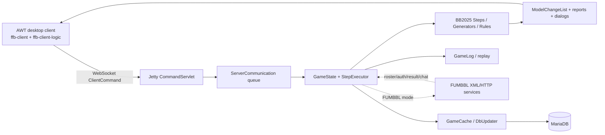
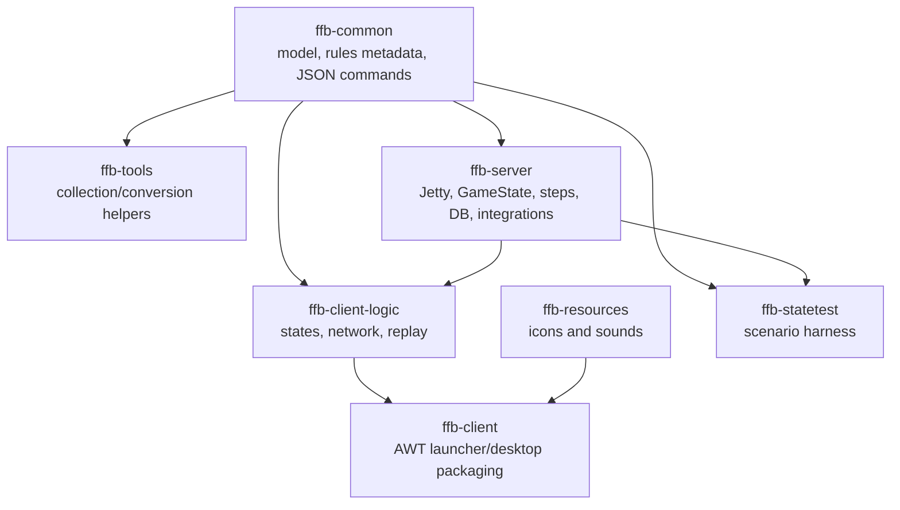

# Architecture and independence audit

**Method and confidence.** This report is source inspection, not a build, run, penetration test, or rules certification. **Verified** means the cited body was inspected. **Inferred** is a migration consequence. **Gap/unknown** identifies work source reading cannot prove. Target: independent public noncommercial browser 2D game, BB2025 first, desktop first/mobile later, with local/exhibition assessment and roster builder; no 3D or league-management requirement.

## Present architecture

The reactor accounts for all seven modules: `ffb-common`, `ffb-tools`, `ffb-server`, `ffb-client`, `ffb-client-logic`, `ffb-resources`, and `ffb-statetest` ([pom.xml:19](../../pom.xml#L19)). The README identifies a Java 8 Swing/AWT client and WebSocket server ([Readme.md:3](../../Readme.md#L3), [Readme.md:26](../../Readme.md#L26)). An import census found no AWT/Swing imports in `ffb-common` or `ffb-server`, so the engine is not presentation-coupled at Java-import level. Its material coupling is protocol/model sync: server steps mutate `Game` and immediately produce client-oriented `ModelChangeList` updates ([UtilServerGame.java:44](../../ffb-server/src/main/java/com/fumbbl/ffb/server/util/UtilServerGame.java#L44), [UtilServerGame.java:62](../../ffb-server/src/main/java/com/fumbbl/ffb/server/util/UtilServerGame.java#L62)).

Input reaches a `ServerCommunication` `LinkedBlockingQueue` ([ServerCommunication.java:75](../../ffb-server/src/main/java/com/fumbbl/ffb/server/net/ServerCommunication.java#L75)). `StepExecutor` invokes the current step, repeats it if needed, calls model sync, then waits or advances the stack ([StepExecutor.java:85](../../ffb-server/src/main/java/com/fumbbl/ffb/server/StepExecutor.java#L85), [StepExecutor.java:108](../../ffb-server/src/main/java/com/fumbbl/ffb/server/StepExecutor.java#L108), [StepExecutor.java:139](../../ffb-server/src/main/java/com/fumbbl/ffb/server/StepExecutor.java#L139)). This is a viable authority seam. Preserve it initially and place a web adapter beside the legacy command serialization; do not replace the executor before a browser slice proves a benefit.

The diagram is a source-derived current-state map, not a target architecture. It highlights where a JSON browser adapter can be added: translate browser intents at the left boundary and legacy sync/dialog output at the right, while retaining the middle engine and MariaDB initially.

This dependency map is functional rather than a full Maven graph: it captures the collaboration-relevant module roles from root configuration and source structure. `ffb-statetest` is a test-support consumer of common/server behavior; it is not runtime product infrastructure.

### Verified authoritative flows

| Flow | Dispatch/validation | State mutation and synchronization | Audit conclusion |
| --- | --- | --- | --- |
| Move | Desktop logic emits `ClientCommandMove` ([ClientCommunication.java:177](../../ffb-client-logic/src/main/java/com/fumbbl/ffb/client/net/ClientCommunication.java#L177)). BB2025 `StepInitMoving` requires current player, verifies acting-player ID and `isValidMove`, transforms side-specific coordinates and trims unsafe path entries ([StepInitMoving.java:166](../../ffb-server/src/main/java/com/fumbbl/ffb/server/step/bb2025/move/StepInitMoving.java#L166), [StepInitMoving.java:173](../../ffb-server/src/main/java/com/fumbbl/ffb/server/step/bb2025/move/StepInitMoving.java#L173)). | `StepMove` increments movement; changes player/ball location, rushing result, move squares and dice decorations ([StepMove.java:94](../../ffb-server/src/main/java/com/fumbbl/ffb/server/step/bb2025/move/StepMove.java#L94), [StepMove.java:112](../../ffb-server/src/main/java/com/fumbbl/ffb/server/step/bb2025/move/StepMove.java#L112), [StepMove.java:126](../../ffb-server/src/main/java/com/fumbbl/ffb/server/step/bb2025/move/StepMove.java#L126)). Executor synchronization publishes changes. | **Verified server-authoritative ingress path.** Browser preview remains advisory. |
| Block/reroll | `StepInitSelecting` accepts a block only for matching acting player and publishes defender/attack flags ([StepInitSelecting.java:248](../../ffb-server/src/main/java/com/fumbbl/ffb/server/step/bb2025/shared/StepInitSelecting.java#L248)). `StepInitBlocking` checks current player/actor again, then records defender and modifiers ([StepInitBlocking.java:126](../../ffb-server/src/main/java/com/fumbbl/ffb/server/step/bb2025/block/StepInitBlocking.java#L126)). `StepBlockRoll` handles `CLIENT_BLOCK_CHOICE` ([StepBlockRoll.java:101](../../ffb-server/src/main/java/com/fumbbl/ffb/server/step/bb2025/block/StepBlockRoll.java#L101)). | Initialization sets defender ID, publishes prior state/position, marks defender `BLOCKED`, and converts a blitz move to blitz ([StepInitBlocking.java:204](../../ffb-server/src/main/java/com/fumbbl/ffb/server/step/bb2025/block/StepInitBlocking.java#L204), [StepInitBlocking.java:237](../../ffb-server/src/main/java/com/fumbbl/ffb/server/step/bb2025/block/StepInitBlocking.java#L237)). | **Verified validation and mutation.** Characterize reroll ordering before altering its wire path. |
| Pass/turnover | BB2025 selecting accepts a pass for current actor, transforms target and dispatches the action ([StepInitSelecting.java:275](../../ffb-server/src/main/java/com/fumbbl/ffb/server/step/bb2025/shared/StepInitSelecting.java#L275)). `StepEndPassing` consumes accuracy/fumble/catcher/interceptor/end-turn parameters ([StepEndPassing.java:77](../../ffb-server/src/main/java/com/fumbbl/ffb/server/step/bb2025/pass/StepEndPassing.java#L77)). | It clears range state, credits catches/completions/passing, derives end-turn for touchdown/fumble/empty or opposition possession, and pushes `EndPlayerAction` ([StepEndPassing.java:132](../../ffb-server/src/main/java/com/fumbbl/ffb/server/step/bb2025/pass/StepEndPassing.java#L132), [StepEndPassing.java:212](../../ffb-server/src/main/java/com/fumbbl/ffb/server/step/bb2025/pass/StepEndPassing.java#L212), [StepEndPassing.java:253](../../ffb-server/src/main/java/com/fumbbl/ffb/server/step/bb2025/pass/StepEndPassing.java#L253)). | **Verified sequence-level turnover logic.** Browser should render server prompts/range state rather than decide turnover. |
| Score/end | `StepEndTurn` increments home/away score on touchdown and emits sound ([StepEndTurn.java:312](../../ffb-server/src/main/java/com/fumbbl/ffb/server/step/bb2025/StepEndTurn.java#L312), [StepEndTurn.java:384](../../ffb-server/src/main/java/com/fumbbl/ffb/server/step/bb2025/StepEndTurn.java#L384)). `StepEndGame` sets finish status, clears stack, queues DB update and presents statistics ([StepEndGame.java:48](../../ffb-server/src/main/java/com/fumbbl/ffb/server/step/game/end/StepEndGame.java#L48)). | BB2025 attribution filters unavailable players then prompts/selects and updates player touchdowns ([StepAssignTouchdowns.java:91](../../ffb-server/src/main/java/com/fumbbl/ffb/server/step/bb2025/end/StepAssignTouchdowns.java#L91), [StepAssignTouchdowns.java:127](../../ffb-server/src/main/java/com/fumbbl/ffb/server/step/bb2025/end/StepAssignTouchdowns.java#L127)). | **Verified rules/lifecycle boundary.** Keep rules; move FUMBBL upload/replay saving behind a lifecycle adapter. |
| Join/reconnect/spectate/replay | Join handler enters remote check in FUMBBL mode; approval loads/creates state and attaches sessions ([ServerCommandHandlerJoin.java:43](../../ffb-server/src/main/java/com/fumbbl/ffb/server/handler/ServerCommandHandlerJoin.java#L43), [ServerCommandHandlerJoinApproved.java:34](../../ffb-server/src/main/java/com/fumbbl/ffb/server/handler/ServerCommandHandlerJoinApproved.java#L34)). `SessionManager` records home/away/spectator associations ([SessionManager.java:16](../../ffb-server/src/main/java/com/fumbbl/ffb/server/net/SessionManager.java#L16)); `GameLog` retains replayable server commands ([GameLog.java:35](../../ffb-server/src/main/java/com/fumbbl/ffb/server/GameLog.java#L35)). | `ServerCommunication.sendGameState` can send a complete state to one session ([ServerCommunication.java:517](../../ffb-server/src/main/java/com/fumbbl/ffb/server/net/ServerCommunication.java#L517)); client replay queues commands ([ClientReplayer.java:103](../../ffb-client-logic/src/main/java/com/fumbbl/ffb/client/ClientReplayer.java#L103)). | **Verified mechanisms; recovery and audience payload filtering remain gaps.** |

## Module choices

| Module | Verified responsibility | First web-slice disposition |
| --- | --- | --- |
| `ffb-common` | Domain model, rules metadata, legacy JSON commands, factories. | **Retain behind seams.** Add browser DTOs only where legacy commands cannot serve. |
| `ffb-server` | Authoritative state/steps, Jetty, persistence, integration/replay. | **Retain engine; refactor adapters.** |
| `ffb-client-logic` | Desktop interaction, states, transport/replay. | **Use as UX reference; replace browser presentation incrementally.** |
| `ffb-client` | AWT main/packaging. | **Retain for parity/local desktop; not web infrastructure.** |
| `ffb-resources` | Icon/sound artifact. | **Inventory licences/provenance, package permitted assets.** |
| `ffb-tools` | Collection/conversion/utility code. | **Keep local conversion helpers; remove runtime dependence on remote collection.** |
| `ffb-statetest` | Engine scenario driver/helpers. | **Retain as characterization suite.** |

## External dependency contracts

“Effort” is inferred solo-developer size after an engine seam exists.

| Service contract | Route/caller | Request → response visible in source | Local alternative | Effort |
| --- | --- | --- | --- | --- |
| Auth | `fumbbl.auth.challenge`/`response`; password request and check ([ServerUrlProperty.java:45](../../ffb-server/src/main/java/com/fumbbl/ffb/server/ServerUrlProperty.java#L45), [FumbblRequestCheckAuthorization.java:85](../../ffb-server/src/main/java/com/fumbbl/ffb/server/request/fumbbl/FumbblRequestCheckAuthorization.java#L85)). | XML challenge/response; `OK` response prefix grants authorization. | Local account/session or development guest identity tied to match role. | M |
| Roster/team | `fumbbl.teams`, `team`, `roster`, `roster.team`; loader ([ServerUrlProperty.java:47](../../ffb-server/src/main/java/com/fumbbl/ffb/server/ServerUrlProperty.java#L47), [UtilFumbblRequest.java:142](../../ffb-server/src/main/java/com/fumbbl/ffb/server/request/fumbbl/UtilFumbblRequest.java#L142)). | XML documents parsed into model. | Versioned BB2025 catalog, validated local builder, match roster snapshot. | L |
| Game state | `fumbbl.gamestate.*` create/check/resume/update/remove ([ServerUrlProperty.java:51](../../ffb-server/src/main/java/com/fumbbl/ffb/server/ServerUrlProperty.java#L51)). | HTTP XML with game/team/score/half/turn/spectator data, leading to internal commands. | Local match repository preserving current snapshot/log first. | L |
| Results | `fumbbl.result`, uploaded only in FUMBBL mode ([ServerUrlProperty.java:57](../../ffb-server/src/main/java/com/fumbbl/ffb/server/ServerUrlProperty.java#L57), [StepEndGame.java:59](../../ffb-server/src/main/java/com/fumbbl/ffb/server/step/game/end/StepEndGame.java#L59)). | Result serialization/upload. | Local result persistence; later export. | S |
| Images | Pitch URL option default ([UtilServerStartGame.java:212](../../ffb-server/src/main/java/com/fumbbl/ffb/server/util/UtilServerStartGame.java#L212)); tool icon cache builders. | URL supplied as game option; retrieval not fully traced. | Bundled licensed asset manifest. | M; asset scope gap |
| Chat | `fumbbl.talk`, uploaded by handler ([ServerUrlProperty.java:58](../../ffb-server/src/main/java/com/fumbbl/ffb/server/ServerUrlProperty.java#L58), [ServerCommandHandlerTalk.java:97](../../ffb-server/src/main/java/com/fumbbl/ffb/server/handler/ServerCommandHandlerTalk.java#L97)). | Chat JSON in remote request; local `ServerCommandTalk`. | Match-scoped local stream/store. | M |
| Markings | `fumbbl.playermarkings`, delivered in automatic markings command ([ServerUrlProperty.java:60](../../ffb-server/src/main/java/com/fumbbl/ffb/server/ServerUrlProperty.java#L60), [ServerCommunication.java:616](../../ffb-server/src/main/java/com/fumbbl/ffb/server/net/ServerCommunication.java#L616)). | Coach/game/rules lookup returns configuration. | Local per-user preference; defer if needed. | S |
| Backup/storage | Backup URLs/S3 config and `UtilBackup` gzip state ([ServerUrlProperty.java:40](../../ffb-server/src/main/java/com/fumbbl/ffb/server/ServerUrlProperty.java#L40), [UtilBackup.java:54](../../ffb-server/src/main/java/com/fumbbl/ffb/server/admin/UtilBackup.java#L54)). | Gzipped serialized game state. | Local DB blob/file store and replay archive. | M |

## Findings and proof sequence

**Priority A — self-contained startup is a delivery requirement, not a proven defect.** `run` loads a JDBC driver/configuration before normal operation ([FantasyFootballServer.java:145](../../ffb-server/src/main/java/com/fumbbl/ffb/server/FantasyFootballServer.java#L145)); docs say standalone requires MySQL/MariaDB ([Readme.md:75](../../Readme.md#L75)). `server.ini` names FUMBBL, admin, backup and storage settings ([server.ini:16](../../ffb-server/server.ini#L16), [server.ini:98](../../ffb-server/server.ini#L98)). Provide reproducible local profile/data/credentials and test it; do so around the current engine.

**Priority A — establish adapters, then prove the web vertical slice.** Introduce identity, roster catalog, match storage, lifecycle, asset, chat and markings ports while preserving legacy defaults. Drive local roster selection → setup → move/block/reroll → pass/turnover → score/end → replay through current engine authority. Defer executor replacement, event-store conversion, or scanner replacement unless measured/tested need appears.

**Priority B — public route security and projection are audit gaps.** Jetty mounts admin, gamestate, backup, command and file routes ([FantasyFootballServer.java:183](../../ffb-server/src/main/java/com/fumbbl/ffb/server/FantasyFootballServer.java#L183)). This review did not prove authorization failure, TLS, rate limits, or route exposure. It also did not enumerate every command payload by recipient. Treat both as deployment/projection test work, not established vulnerabilities.

**Priority B — characterize concurrency/recovery.** Input is queued, while persistence, request processor, replay thread and timers run independently ([FantasyFootballServer.java:193](../../ffb-server/src/main/java/com/fumbbl/ffb/server/FantasyFootballServer.java#L193), [FantasyFootballServer.java:249](../../ffb-server/src/main/java/com/fumbbl/ffb/server/FantasyFootballServer.java#L249)). Preserve queue semantics and test disconnect/rejoin, duplicate submit and restart at waits. Fortuna/server entropy are visible ([FantasyFootballServer.java:118](../../ffb-server/src/main/java/com/fumbbl/ffb/server/FantasyFootballServer.java#L118), [FantasyFootballServer.java:230](../../ffb-server/src/main/java/com/fumbbl/ffb/server/FantasyFootballServer.java#L230)); quality/reproducibility are unassessed.

## Persistence and standalone trace

At server start the normal path prepares DB query/update factories, initializes `GameCache`, starts `DbUpdater`, creates session managers and starts communication ([FantasyFootballServer.java:170](../../ffb-server/src/main/java/com/fumbbl/ffb/server/FantasyFootballServer.java#L170), [FantasyFootballServer.java:193](../../ffb-server/src/main/java/com/fumbbl/ffb/server/FantasyFootballServer.java#L193)). `GameCache.findOpenGamesForCoach` delegates to a DB query and `createGameState` constructs a `Game` through the factory source ([GameCache.java:201](../../ffb-server/src/main/java/com/fumbbl/ffb/server/GameCache.java#L201), [GameCache.java:214](../../ffb-server/src/main/java/com/fumbbl/ffb/server/GameCache.java#L214)). `GameState` carries the game, step stack and `GameLog`; serialization emits the game log as part of state ([GameState.java:58](../../ffb-server/src/main/java/com/fumbbl/ffb/server/GameState.java#L58), [GameState.java:364](../../ffb-server/src/main/java/com/fumbbl/ffb/server/GameState.java#L364)). The backup helper can persist/load compressed state ([UtilBackup.java:54](../../ffb-server/src/main/java/com/fumbbl/ffb/server/admin/UtilBackup.java#L54), [UtilBackup.java:110](../../ffb-server/src/main/java/com/fumbbl/ffb/server/admin/UtilBackup.java#L110)).

This establishes a practical migration boundary: keep `GameState` snapshot/log compatibility while replacing only repository and lifecycle adapters. The first local implementation needs stable identifiers for match, coach/guest and roster snapshot; storage of current sequence/step state; durable result/replay discovery; and an atomic update boundary sufficiently strong for the single current server queue. Whether the existing DB updater supplies an adequate crash-consistency guarantee is **unknown** until restart testing, so do not infer it from the presence of serialized state.

## Security and audience assessment boundaries

The action helpers make role checks visible: `UtilServerSteps.checkCommandIsFromHomePlayer` and `checkCommandIsFromAwayPlayer` compare the received session with the session manager’s team session ([UtilServerSteps.java:59](../../ffb-server/src/main/java/com/fumbbl/ffb/server/step/UtilServerSteps.java#L59)). Concrete move/block/pass entry steps call current-player and acting-player checks as listed above. That is evidence of server-side validation on traced flows, not proof that all commands and administrative routes obey it.

For a public web deployment, define tests around four recipients—home player, away player, spectator, administrator—and four transitions—new join, reconnect, role change and replay join. For each, assert the accepted intent set and the serialized DTO fields. This is especially important because the legacy model sync is structured around desktop-oriented model and presentation commands: `sendModelSync` receives the aggregate `ModelChangeList`, reports, animation and sound ([ServerCommunication.java:592](../../ffb-server/src/main/java/com/fumbbl/ffb/server/net/ServerCommunication.java#L592)). Source inspection did not establish a harmful disclosure, so the finding is an unproven projection boundary, not a reported vulnerability.

## Browser delivery boundary

The browser client should own rendering, input affordances, local animation and connection recovery UI. The Java engine should continue owning action sequencing, dice, legal-state decisions, score/turn state and reports. A thin adapter can translate browser `move`, `block`, `pass`, `choose die`, `use/decline reroll`, `end turn`, and setup intents into the current `ClientCommand` objects after match-role lookup; then translate server model sync/dialog/report commands into a stable browser view. This is intentionally a compatibility layer, not an assertion that the Java command schema is a permanent public API.

Use the current desktop client as a behavioral reference for game-phase input and replay, while treating it as replaceable presentation. Desktop-first browser delivery can use pointer/mouse controls and responsive layout without building a mobile rules client. Touch-specific selection, offline play and mobile assets can wait until the web vertical slice identifies real requirements.
