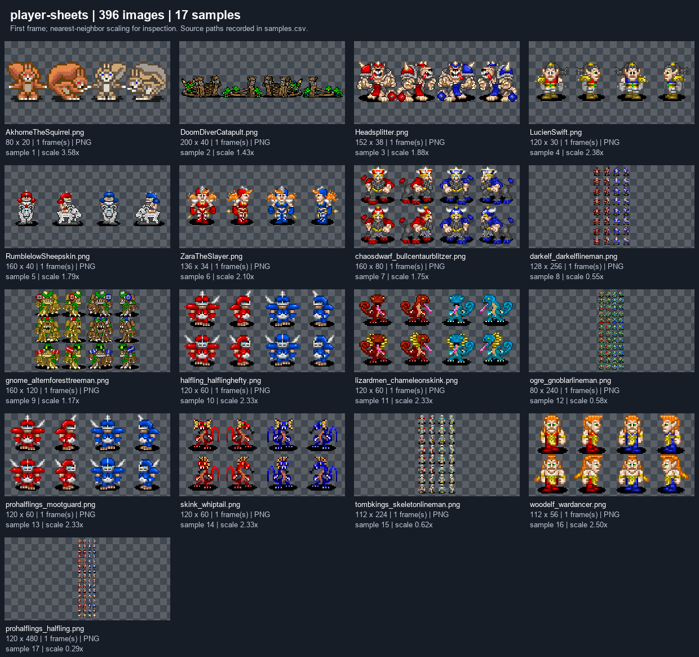
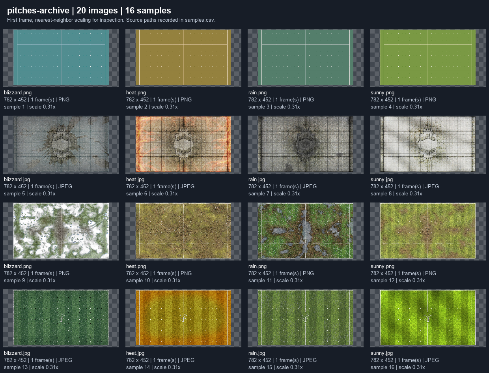

# Asset inventory and 2D visual strategy

## Measured scope and reproducibility

**Verified:** all Git-tracked media with recognized image/audio/font/archive extensions were inventoried at revision `882fe8721dcc44b2958346629b41e469edb8d12b`. The scan excludes `.notes`, build outputs and bundled third-party JAR repositories. It reads archives in memory; original files are unchanged. Generated contact sheets are inspection derivatives, not replacement artwork.

| Measured item | Result |
|---|---:|
| Tracked media/archive files | 1,260 |
| PNG / GIF filename extensions | 1,121 / 84 |
| OGG / WAV files | 46 / 5 |
| ZIP archives | 4 |
| Archive members | 24: 20 pitch images and 4 configuration files |
| Total inventory rows | 1,284, including the archive containers and members separately |
| Stored media/archive bytes | 30,467,349 (about 29.1 MiB) |
| Additional uncompressed archive-member bytes | 8,376,574; do not add this to stored bytes as if separate files |
| Exact duplicate content groups | 87, with 99 entries beyond one copy per group |
| Decoded images with multiple file frames | 0 |
| Image decoding errors | 0 |
| Source/config literal asset references | 7,079 occurrences; 2,037 contain HTTP URLs |
| Visually reviewed samples | 230 across 18 image categories |

Evidence: [inventory summary](evidence/inventory-summary.json), [complete inventory CSV](assets/inventory.csv), [archives](assets/archive-members.csv), [duplicates](assets/exact-duplicates.csv), [loading references](assets/loading-references.csv), [remote references](assets/remote-asset-references.csv). HTTP reference counts include repeated development/live/test mappings, not distinct live assets or download requirements.

Inventory fields include source path, archive membership, category, byte count, SHA-256, actual decoded format, dimensions, mode, transparency, frame count, duration, provenance status, and literal filename reference candidates. Candidate references are not a verified reachability graph: Java property lookup, URL rewriting and dynamic sprite selection need the code traces below. [Variant candidates](assets/variant-candidates.csv) are filename heuristics, not proof of visual equivalence.

The collector uses Git's NUL-delimited UTF-8 paths so accented player names are included. It does not inspect images embedded inside third-party JARs, remote-only images, runtime-created overlays, or future user uploads. No remote artwork was downloaded. No standalone font files were found among the tracked media extensions.

## Visual review

Every category below was visually inspected through its labeled contact sheet. Samples span filenames and dimension extremes; they are not a complete manual review of every sprite row. [All contact sheets and sample source mapping](assets/README.md).

| Category | Images | Observed appearance and migration implication |
|---|---:|---|
| Player sheets | 396 | Upright pixel sprites in four columns, usually red/blue pairs with idle/moving poses; row counts and cell sizes vary. Preserve pose/team semantics explicitly. |
| Portraits | 368 | Painted illustrations largely on 95×147 parchment cards; visibly different treatment from board sprites. Treat portraits as a separate optional layer, not enlarged sprites. |
| Pitch archive images | 20 | Basic flat fields, textured stone, weathered grass and branded cup fields; all inspected pitch images are 782×452. Prefer subdued pitch texture and independently drawn grid/lines. |
| Actions | 37 | Mostly tiny ~20 px pictograms; several actions reuse identical pictures. Labels and contextual explanations are necessary. |
| Animation assets | 99 | Separate explosion/lightning frames, rotated objects, and large raster text banners. Recreate timing and meaning from code; a one-frame file is not evidence of no animation. |
| Status decorations | 26 | Color squares, status symbols, ball/bomb indicators; some combine multiple icons. Needs explicit layer precedence and non-color cues. |
| Sidebar | 37 | Stone/parchment textures, beveled buttons, resource icons and dice. Replace panel chrome with responsive DOM/CSS; avoid stretching textured text/buttons. |
| Scorebar | 17 | Raster home/away labels, fan-count variants and weather illustrations. Render values and headings as text. |
| Game | 38 | Push arrows, ball/bomb, dice, coin and branded splash art. Keep interaction meanings; separate branding and decorative art. |
| Cursors | 27 | Arrow plus action symbol; some invalid states are small grey variants or crossed out. Do not make the cursor the only action-state signal; touch has none. |
| Replay | 28 | Repeated arrows/pause with color-only active/selected/disabled variants. Replace with semantic buttons, labels, focus and disabled state. |
| Bloodspots | 28 | Mixed pixel and soft/textured damage/craters. Cosmetic only; offer reduced effects and keep cell/ball visibility. |
| Emoji | 89 | Smooth emoji plus game-specific dice/result symbols. Preserve licensing distinction and avoid gameplay information conveyed only by emoji. |
| Abstract players | 6 | Three sizes of red/blue shaded tokens. Useful visual fallback concept; add labels/shapes for side and position. |
| Menu | 3 | Pencil/sketch state symbols, including a crossed-out state. Keep textual equivalents. |
| Overlays | 3 | Small black text/trash icons. Low contrast on dark surfaces requires new theme-aware versions. |
| Augments | 2 | Black/white concentric targets. Select a contrast-safe variant based on underlying board. |
| Other cached image | 1 | Four-pose transformed-player sheet. Include transformation state in sprite manifests. |

### Specific findings

**A-01, verified, normalization needed:** six `.png` files decode as GIF: `RIPbloodspot5`, `BigJoboHairyfoot`, `Crumbleberry`, `FrankNStein`, `Grak`, and `prizeplayers_sandskeleton`. Full source paths and decoded formats are in the inventory. A web packaging pipeline must validate content signatures and normalize extension/MIME together; do not blindly rename references. This is an asset consistency issue, not a demonstrated browser failure.

**A-02, verified/inferred, preserve semantic aliases:** byte-identical assets can represent different actions (for example `block.gif` and `vicious_vines.gif`). Deduplicate storage through a manifest while retaining semantic IDs. Do not delete files solely because their hashes match. The 99 duplicate entries include archive-member equivalences and are not automatically 99 safe file deletions.

**A-03, observed/inferred, style coherence:** pixel players, painted portraits, photographic/textured chrome, and smooth resource symbols coexist. Upscaling alone will not establish a coherent art direction. A consistent board plus clean, readable DOM panels delivers more immediate value than recreating every portrait.

**A-04, observed/inferred, accessibility:** red/blue team colors and red/yellow replay states carry meaning. Add shape/outline/text cues and labeled state announcements. No numerical contrast certification or color-vision simulation was performed; observations identify test requirements, not a compliance result.

**A-05, observed, text baked into artwork:** kickoff/prayer banners and some home/away labels include words in pixels. New UI text should be separately rendered for resizing, localization and screen readers. Preserve the announcement event, not the bitmap wording.

## Loading and sprite contracts

1. `IconCache.init` reads `icons.ini` and `statics.ini`; `loadIconFromArchive` maps URL keys into classpath resources; `loadIconFromUrl` provides remote loading. A URL-looking identifier does not prove a network request is necessary. [IconCache methods, lines 141, 179, 325](../../ffb-client-logic/src/main/java/com/fumbbl/ffb/client/IconCache.java).
2. Pitch URLs carry a weather suffix; ZIP `pitch.ini` selects the weather-specific image. All four archive member lists were inspected. The new manifest should select weather by semantic ID, not preserve string slicing assumptions. [IconCache.loadPitchFromStream, line 585](../../ffb-client-logic/src/main/java/com/fumbbl/ffb/client/IconCache.java#L585).
3. `PlayerIconFactory.getBasicIcon` computes cell size as sheet width/4, chooses columns 0/1 for home and 2/3 for away, and selects row using `iconSetIndex`. Color swapping can mirror rendering. It then layers ball/bomb and other decorations. Preserve these meanings when converting sprite sheets, even if the exported layout changes. [PlayerIconFactory, lines 110–250](../../ffb-client-logic/src/main/java/com/fumbbl/ffb/client/PlayerIconFactory.java#L110).
4. `BuildStandaloneIconCache` maps localhost player/portrait/pitch URLs to bundled files. Treat it as evidence of an offline mapping approach, not a ready web manifest generator. [BuildStandaloneIconCache.collectIcons](../../ffb-tools/src/main/java/com/fumbbl/ffb/tools/BuildStandaloneIconCache.java#L32).
5. Generated visuals include player marker text, opacity, status composition, and dynamically selected images; they will not appear as separate inventory files. `FontCache` uses an AWT logical Sans Serif font. Reproduce meaning through web controls and canvas rendering, not a Java font binary. [PlayerIconFactory.markIcon/fadeIcon](../../ffb-client-logic/src/main/java/com/fumbbl/ffb/client/PlayerIconFactory.java#L64); [FontCache](../../ffb-client-logic/src/main/java/com/fumbbl/ffb/client/FontCache.java#L13).

## Art direction decision

| Direction | Readability/scale | Production burden | Recommendation |
|---|---|---|---|
| Crisp pixel players + restrained field + clean vector/DOM UI | Strong grid alignment; integer sprite scaling helps, labels remain sharp | Moderate; strict palette/cell/pose rules required | **Preferred starting direction**, consistent with user preference but open to art review |
| Flat illustrated tokens/portraits + vector UI | Strong silhouettes, easier large-scale labels and flexible zoom | Low/moderate for initial roster; less character detail | Best fallback or accessibility mode; also suits prototype placeholders |
| Detailed hand-painted 2D characters and pitch | Attractive large art; small units/overlays can become crowded | High; many consistent poses/statuses/rosters | Defer until production capacity is demonstrated |

Use a top-down grid with upright 2D sprites initially. Isometric-looking 2D art would require renewed occlusion/picking checks without helping rules correctness. No 3D pipeline is proposed. The final style decision needs a small later comparison at actual board size, not a gallery of isolated enlarged characters.

## Proposed production and delivery contract

Use stable semantic asset IDs separate from filenames, e.g. category/roster/position/variant. Record author, source URL or source file, license/permission evidence, modification history, rules/catalog mapping, team variant, pose, frame rectangles/pivots and scale policy. Keep editable originals and web exports separate. Export lossless PNG atlases for sprites, SVG for simple UI icons, and evaluate compressed pitch imagery only against visual comparisons. Confirm alpha edges and nearest-neighbor vs smooth rendering per category.

Choose logical sprite cells only after testing representative small, normal and large players on the board. Do not force every existing sheet into 32×32 or bake current `width/4` assumptions into the new renderer. Asset validation should detect out-of-bounds frames, unknown IDs, missing home/away/pose variants and ambiguous mime types.

Build manifests reproducibly with hashes and documented semantic aliases. Load core UI, one pitch and the participating rosters first; cache fingerprinted exports; fail to a clear token placeholder when a cosmetic asset is missing. Defer portraits, optional effects and unused teams. Loaders must not block authoritative state updates.

Prioritize: (1) neutral prototype board/tokens, (2) status/ball/action clarity and accessible controls, (3) two supported roster sets and weather treatment, (4) broader catalog/portraits, (5) decorative effects. Rebuild content only after style and rights evidence are reviewed.

## Provenance, audio and fonts

**Verified:** root MIT notice and `licenses/NotoEmoji-OFL.txt` are present. **Unknown:** per-image authorship/source/permission for most art, including cached portraits, named characters and branded pitches; the Noto notice does not identify every file in the mixed emoji folder. Noncommercial intent is a scope decision, not clearance evidence. The Gemini summary's legal conclusions have not been adopted. Record unresolved code/data/artwork/name questions for qualified review; no legal conclusion is made here. [Root license](../../LICENSE); [Noto notice](../../ffb-resources/src/main/resources/licenses/NotoEmoji-OFL.txt).

The 51 audio files are inventoried by name, size and hash. Their filenames map to gameplay effects and crowd reactions, but audio content, loudness and codec playback have not been audited by listening/browser tests. Treat them as optional effects with mute/volume and visible equivalents. Browser autoplay restrictions require an explicit user gesture or handling of blocked playback. [Browser autoplay guidance](https://developer.mozilla.org/en-US/docs/Web/Media/Guides/Autoplay).

No tracked TTF/OTF/WOFF files were found. AWT's logical font selection is not a web font specification. Use a system sans-serif stack initially; choose any custom licensed font independently. Future audio/font conversion and licensing work must remain visible in the production backlog.
