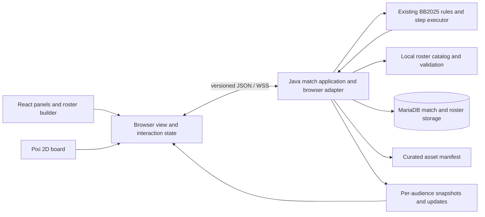

# Technology assessment and architecture decisions

Status: **ADR-001 through ADR-004 accepted by the owner on 2026-09-06; ADR-005 deferred, with GCP the likely hosting provider.** Acceptance selects the destination; it does not establish implementation or benchmark results. The assessment below is grounded in the audited revision and official documentation consulted 2026-09-06. Architectural judgments and effort estimates are audit inferences, not vendor claims. See [implementation kickoff](09-implementation-kickoff.md) for subsequent owner decisions and session boundaries.

## Recommendation

Build a new TypeScript browser client over the existing Java rules implementation. Introduce application and browser interfaces around the engine, replacing FUMBBL service dependencies gradually. Keep the stack-based rules executor and existing serialization as characterization references until a working vertical slice establishes which seams actually need changing. Do not simultaneously rewrite rules, persistence, networking, and all artwork.

This recommendation is based on the server's existing JSON/WebSocket endpoint (`CommandSocket.onTextMessage`), the BB2025 state harness (`GameStateBuilder`, `StepEngine`, `TestRolls`), and the census showing **zero direct AWT/Swing imports in common/server**, versus 182 files in client-logic. The domain is coupled to application services, but it does not first need Swing stripped from the server. See [architecture evidence](01-architecture-and-independence.md), [module census](evidence/modules.csv), and [verification](07-verification-and-coverage.md).

## Compare the three overhaul approaches

Priority order: preserve rules behavior and fulfill browser play; then minimize solo delivery/maintenance effort; then improve testability, operations, and performance. Browser delivery is mandatory. Scores would imply precision unsupported by this audit, so the comparison is qualitative.

| Criterion | Incremental legacy modernization | Browser client + retained Java rules | Broad rewrite, e.g. TypeScript server |
|---|---|---|---|
| Browser outcome | Desktop cleanup alone does not meet it; eventually needs a client replacement | Directly meets it | Meets it after rebuilding engine and client |
| Rules preservation | Highest immediate reuse | High reuse, with contract and projection risks | Lowest confidence until extensive differential tests exist |
| Migration effort | Lowest early effort, but pays desktop work before web work | Moderate/high; concentrated on client and service seams | Highest; every rules interaction must be re-established |
| Solo maintainability | Existing Java familiarity; desktop constraints persist | Two languages, but each has a clear responsibility | One main language, offset by owning a newly rewritten rules engine |
| Tests | Existing tests retained, browser tests still needed | Existing Java scenarios plus browser contract tests | Need to build a new baseline and maintain the legacy oracle during transition |
| Operations | Existing DB/service assumptions | One JVM service + database + static web delivery | Similar hosting needs; Node does not remove persistence/auth work |
| Performance | No evidence of a current performance defect | Ample plausible fit for a turn-based board; benchmark required | No measured reason that a rewrite improves this workload |
| Disposition | Use selectively for build/runtime repairs and characterization | **Recommended** | Defer unless a measured blocker defeats reuse |

Reconsider the recommendation if the prototype cannot host the existing rules without pervasive service side effects, or if measured protocol/engine complexity exceeds the cost of a narrowly scoped replacement. Count the failed experiments and parity-test burden before making that decision; line count alone is insufficient.

## ADR-001: Java backend; modernize runtime independently

Decision status: **accepted**. The proposal below is now the agreed direction.

**Proposed:** keep Java and Maven; target Java 21 for the new server runtime, after baseline checks and dependency compatibility work. Preserve the Java 8 baseline as a comparison during migration. The current root POM already describes a Java 21 Mockito profile; that is evidence of intended build support, not proof of production runtime compatibility.

Keep embedded Jetty as the first server-framework candidate, upgrading to a supported 12.x line with compatibility tests before public deployment. Existing server POM pins Jetty **9.4.0.v20161208**, and Jetty's official lifecycle page marks 9.4 EOL; Jetty 12 requires Java 17 or newer. This is a verified maintenance gap, not a claim of a demonstrated vulnerability. [Server POM, WebSocket dependencies](../../ffb-server/pom.xml#L94); [Jetty support table](https://jetty.org/download.html).

**Alternatives:** Kotlin can call Java and could gradually host adapters, but adds language/tooling burden without removing the existing architecture. Spring Boot is reasonable if authentication, administration, and web APIs grow substantially; its current requirements start at Java 17 and represent a framework migration, not a drop-in Java 8 wrapper. Node.js is useful for frontend tooling, but a Node game server either duplicates the rules or introduces another service calling Java. None is justified for the first slice. [Kotlin interoperability](https://kotlinlang.org/docs/java-interop.html); [Spring Boot requirements](https://docs.spring.io/spring-boot/system-requirements.html).

**Keep initially:** MariaDB/JDBC, with an isolated disposable local instance and versioned schema setup. Changing database technology while changing the client adds a second durability risk. The README's old MySQL connector compatibility statement is not the current POM: the declared driver is MariaDB Java client 3.5.8. Verify a supported server/driver combination in the local startup milestone; no database compatibility test was performed by the source audit. [Readme startup section](../../Readme.md); [declared dependency inventory](evidence/dependencies.csv).

## ADR-002: TypeScript, React DOM interface, PixiJS board, Vite

Decision status: **accepted**, including React. The subsequent Svelte comparison did not change this selection.

**Proposed:** TypeScript for browser code, React for forms/panels/roster editing, CSS for layout, and PixiJS 8 with WebGL for the 2D board. Keep rendering behind a small board-view interface so it does not own rules or connection state. React and Pixi must not both independently mutate gameplay state.

| Renderer | Strength for this game | Cost/limitation | Decision |
|---|---|---|---|
| PixiJS | Sprite/overlay scene graph, GPU rendering, input handling; focused on presentation | Scene transitions/audio and accessible interactions need deliberate integration | **Preferred** for a rules-driven board with substantial DOM UI |
| Phaser | Integrated 2D game framework, input, scenes, animation and audio; JS/TS support | More framework lifecycle concepts to coordinate with forms and server state | Strong fallback if prototype benefits materially from its integrated tooling |
| Canvas 2D directly | Small dependency surface; easy basic board drawing | Own hit testing, zoom, asset management, redraw policy and accessibility bridge | Suitable for a disposable diagnostic viewer; less attractive as the growing product client |
| DOM/SVG board | Semantic controls and inspectable layout; strong for simple vector shapes | More manual layering and sprite/animation integration | Keep for controls and accessible companion view; reconsider for board if prototype proves simpler |

Pixi's current docs recommend WebGL for production, describe WebGPU as experimental, and list a Canvas renderer as coming soon. Therefore, **do not promise automatic Canvas fallback** with this choice: show a clear unsupported-renderer message if WebGL initialization fails, and test that path. Pixi accessibility is opt-in through DOM overlays; it does not make the game accessible automatically. [Pixi renderers](https://pixijs.com/8.x/guides/components/renderers); [Pixi accessibility](https://pixijs.com/8.x/guides/components/accessibility).

Phaser is a browser-oriented 2D framework with JavaScript/TypeScript support and WebGL/Canvas rendering. Pin a specific supported major before prototyping; do not copy the notes' Phaser 3 assumption as an audit conclusion. [Phaser introduction](https://docs.phaser.io/phaser/getting-started/what-is-phaser). React's component/event/state model fits the roster builder and panels; choosing it here is a maintainability judgment, not a performance finding. [React guide](https://react.dev/learn).

Use Node 24 LTS for the proposed frontend toolchain rather than an obsolete Node minimum. Vite documents minimum Node requirements, while Node's lifecycle page identifies supported release lines; revalidate both when pinning the implementation lockfile. Node is not a required game-server process in this design. [Vite requirements](https://vite.dev/guide/); [Node release status](https://nodejs.org/en/about/previous-releases).

## ADR-003: Versioned JSON over browser-native WebSockets

Decision status: **accepted**.

Retain the existing transport category. First prove a browser can encode representative legacy commands and decode responses in an isolated environment. Prefer uncompressed text JSON in the diagnostic slice; test existing LZString framing separately if required. The existing 64 KiB ingress setting and server-side decompression require real payload measurements, including decoded-size limits. [CommandSocket](../../ffb-server/src/main/java/com/fumbbl/ffb/server/net/CommandSocket.java#L25).

For the product interface, introduce a versioned adapter rather than exporting the entire mutable Java object model. Document protocol version, request correlation, ordered state revision, caller role, accepted/rejected actions, full snapshot recovery, and audience projection. Client types are generated or checked against shared protocol fixtures; TypeScript types alone do not validate incoming JSON.

JSON is readable and aligns with the current implementation. Protobuf could improve size and explicit schema evolution, but introduces schema/compiler/client integration work; defer until profiling demonstrates a meaningful benefit. A binary format does not solve authorization, ordering, or replay compatibility. [Protocol Buffers language guide](https://protobuf.dev/programming-guides/proto3/).

Use TLS and an explicitly validated origin/authentication policy for public connections. Browser WebSocket does not provide automatic backpressure; bound outbound queues and use a full resync for slow clients instead of unbounded buffering. [Browser WebSocket API](https://developer.mozilla.org/en-US/docs/Web/API/WebSocket); [WebSocket server guidance](https://developer.mozilla.org/en-US/docs/Web/API/WebSockets_API/Writing_WebSocket_servers).

## ADR-004: Application seams, not an engine rewrite prerequisite

Decision status: **accepted**.

Proposed boundaries (names are conceptual, not existing APIs): `MatchApplication` authenticates and validates a player's intent; `RulesSession` invokes the existing sequence/step engine; `RosterCatalog` supplies immutable versioned position data; `TeamValidation` computes legality and cost; `MatchRepository` stores supported recovery state; `GameViewProjector` emits only recipient-appropriate fields. Side effects at start/end are routed through lifecycle adapters. Introduce seams where a traced dependency requires them; do not mechanically extract every class first.

Preserve one-at-a-time match mutation initially. Keep the current single communication queue until load testing demonstrates a need to partition it. A per-match actor can be a later scalability change; introducing it now would create additional concurrency behavior to verify.

Keep current snapshots/replay format behind a repository interface initially, with a pinned engine/replay version. Validate restoration while a decision is pending. A future canonical event log may improve long-term replay, but is not required to prove browser viability. Do not equate recorded UI commands with a stable domain-event schema.

## ADR-005: Hosting and operating cost

Decision status: **deferred**. Owner preference is likely GCP. Local build and testing proceed independently of provider selection; no cloud service, budget, or deployment is approved by this preference.

Propose a single-region JVM service, one database, and static asset/web delivery. Begin with one host or a small service/database pair; no Kubernetes, microservice decomposition, or mandatory managed multiplayer platform. No vendor was selected or priced: expected concurrency, retention, region, availability target and budget are not yet specified.

Cost worksheet for implementation: monthly compute + database/storage + backup retention + outbound bandwidth + domain/monitoring. Estimate asset bandwidth as new sessions × cache-miss fraction × compressed asset bytes loaded; estimate replay storage as matches × retained serialized bytes × retention. The measured bundled assets total about 29.1 MiB on disk, but that is **not** the required per-session download. Load only the pitch, participating teams and core UI initially.

Before public release measure process RSS/CPU, queue delay, p95 action latency, reconnect time, snapshot/replay size, and backup restore time on a declared machine. Host sizing and dollar estimates without those measurements would be speculation. Backups should be adapter-driven so a local filesystem works in development; evaluate any retained AWS dependency independently before adopting a provider. [AWS Java SDK documentation](https://docs.aws.amazon.com/sdk-for-java/v1/developer-guide/welcome.html).
